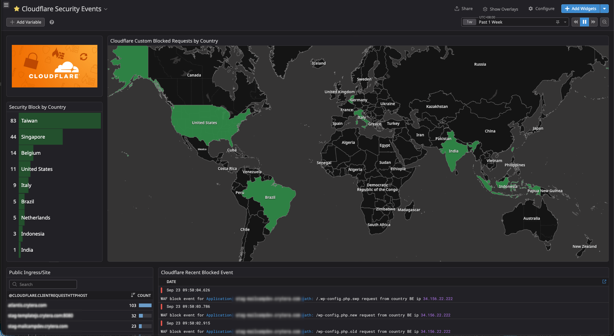

---

# Cloudflare Edge Security

## Overview

Cloudflare is the **first public-facing security and traffic-management layer** of the 2026 network security architecture.

All public HTTP/HTTPS traffic is proxied through Cloudflare before reaching the origin infrastructure.

Cloudflare provides:

* Public edge protection
* HTTPS enforcement
* Origin TLS encryption
* Client IP identification
* Edge request filtering
* Managed challenges
* Protection against common scanners and probes
* Global enforcement of IP bans generated by the Kubernetes security stack

Cloudflare is intentionally used as the **earliest enforcement point** wherever a request can be rejected before consuming origin resources.

---

## Architecture Position

The public request path is:

```text
┌────────────────────────────┐
│        Internet Users      │
└──────────────┬─────────────┘
               │
               │ HTTPS
               ▼
┌──────────────────────────────────────────────┐
│              CLOUDFLARE EDGE                │
│                                              │
│  Proxy: Enabled                              │
│  Always Use HTTPS                            │
│  SSL/TLS: Full (Strict)                      │
│                                              │
│  Edge filtering / challenges                 │
│  Scanner and probe blocking                  │
│  Client identity / request metadata          │
│                                              │
│  Worker + KV Bouncer                         │
│  └── Kubernetes CrowdSec IP bans             │
└──────────────────┬───────────────────────────┘
                   │
                   │ HTTPS
                   ▼
┌──────────────────────────────────────────────┐
│                  OPNsense                   │
│                                              │
│  pf Firewall                                │
│  Network blocklists                         │
│  CrowdSec Firewall Bouncer                  │
└──────────────────┬───────────────────────────┘
                   │
                   │ HTTPS
                   ▼
┌──────────────────────────────────────────────┐
│                    Caddy                    │
│                                              │
│  TLS termination                            │
│  Reverse proxy                              │
└──────────────────┬───────────────────────────┘
                   │
                   │ HTTP
                   ▼
┌──────────────────────────────────────────────┐
│              Suricata IDS / IPS             │
│                                              │
│  Network / protocol inspection              │
│  Detection + IPS enforcement                │
└──────────────────┬───────────────────────────┘
                   │
                   │ HTTP
                   ▼
┌──────────────────────────────────────────────┐
│              Envoy Gateway                  │
│                                              │
│  Kubernetes Gateway API                     │
│  HTTP listeners / routing                   │
│  Upstream service selection                 │
└──────────────────┬───────────────────────────┘
                   │
                   ▼
┌──────────────────────────────────────────────┐
│                 Coraza WAF                  │
│                                              │
│  HTTP inspection                            │
│  OWASP CRS                                  │
│  Application-layer enforcement              │
└──────────────────┬───────────────────────────┘
                   │
                   ▼
              Kubernetes
                   │
                   ▼
            Application Pods
```

Cloudflare is therefore the **outermost enforcement layer**, while OPNsense, Suricata, Envoy Gateway, Coraza, and Kubernetes provide independent downstream controls.

---

## Plan

* **Plan:** Free
* **Proxy:** Enabled
* **Always Use HTTPS:** Enabled
* **SSL/TLS Mode:** Full (Strict)

Cloudflare's Always Use HTTPS feature redirects HTTP visitor requests to HTTPS at the edge.

---

## Responsibilities

Cloudflare is responsible for:

* Hiding the origin's public IP behind the Cloudflare proxy
* Enforcing HTTPS at the edge
* Providing the public TLS certificate
* Filtering known unwanted traffic
* Challenging suspicious clients
* Blocking configured scanner and probe patterns
* Providing the original client IP to the trusted origin chain
* Providing country and forwarding metadata
* Reducing unnecessary traffic reaching the origin
* Enforcing IP bans received from the Kubernetes CrowdSec remediation path

Cloudflare is **not the only security layer**.

Requests that reach the origin continue through:

```text
Cloudflare
    ↓
OPNsense
    ↓
Caddy
    ↓
Suricata IDS/IPS
    ↓
Envoy Gateway
    ↓
Coraza WAF
    ↓
Kubernetes
```

Each layer has its own security responsibility.

---

## Origin Protection

The origin should not be treated as a publicly accessible web endpoint.

The intended request path is:

```text
Internet
   ↓
Cloudflare
   ↓
OPNsense
   ↓
Caddy
   ↓
Suricata
   ↓
Envoy Gateway
   ↓
Coraza
   ↓
Kubernetes
```

Cloudflare provides the public-facing endpoint while the firewall controls access to the origin infrastructure.

The goal is to prevent clients from bypassing Cloudflare and reaching the origin through an alternate public path.

The origin path should therefore only accept traffic through the intended infrastructure chain.

---

## HTTPS Enforcement

Cloudflare enforces HTTPS for public visitors.

```text
HTTP request
     |
     v
Cloudflare
     |
     | 301 redirect
     v
HTTPS
```

The redirect occurs at the public edge, reducing unnecessary plaintext HTTP traffic reaching the origin.

---

## SSL/TLS Mode

```text
SSL/TLS Mode: Full (Strict)
```

Cloudflare uses two encrypted connections:

```text
Client
  |
  | HTTPS
  v
Cloudflare
  |
  | HTTPS
  v
Caddy
```

Cloudflare-to-origin traffic remains encrypted until Caddy terminates TLS.

After TLS termination:

```text
Caddy
  |
  | HTTP
  v
Suricata
  |
  v
Envoy Gateway
```

This placement allows downstream network and application security controls to inspect the traffic at the appropriate layer.

### Why Full (Strict)

```text
Flexible
   ✗ HTTP between Cloudflare and origin

Full
   ✓ HTTPS between Cloudflare and origin
   ✗ Origin certificate is not fully validated

Full (Strict)
   ✓ HTTPS between Cloudflare and origin
   ✓ Origin certificate is validated
```

Full (Strict) is the required mode for this architecture.

---

# Edge Security Rules

Cloudflare performs inexpensive filtering before traffic enters the origin infrastructure.

The current rules target obvious automated scanning and sensitive-resource probing.

## Rule 1 — Block Scanners and Sensitive Probes

### Purpose

Block common automated scanners and requests for sensitive resources before they reach the origin.

### Action

```text
Block
```

### Expression

```text
lower(http.user_agent) contains "sqlmap" or
lower(http.user_agent) contains "sqlninja" or
lower(http.user_agent) contains "havij" or
http.request.uri.path contains "phpinfo.php" or
http.request.uri.path contains "wlwmanifest.xml" or
http.request.uri.path contains ".env" or
http.request.uri.path contains "/wp-login.php" or
http.request.uri.path contains "/xmlrpc.php" or
http.request.uri.path contains ".git" or
http.request.uri.path contains "/debug.log"
```

These rules are intended to remove obvious, low-value Internet scanning before it consumes origin resources.

They do **not** replace:

* Suricata IDS/IPS
* Coraza WAF
* CrowdSec behavioral detection

---

## Rule 2 — Challenge HTTP/1.0 Clients

### Purpose

Challenge legacy or unusual HTTP clients that are not required by supported application traffic.

### Condition

```text
HTTP version = HTTP/1.0
```

### Action

```text
Managed Challenge
```

This rule is an additional edge signal rather than a replacement for application-layer security.

---

# Client Identity

Cloudflare provides the original client identity to the trusted origin chain.

Important headers include:

```text
CF-Connecting-IP
CF-IPCountry
X-Forwarded-For
```

## `CF-Connecting-IP`

Contains the original client IP as observed by Cloudflare.

This is important because downstream security controls need to identify the actual Internet client rather than Cloudflare's proxy address.

## `CF-IPCountry`

Provides the country associated with the client IP.

This can be used for:

* Geographic analysis
* Logging
* Security dashboards
* Investigation

It should not be treated as a standalone indication of malicious activity.

## `X-Forwarded-For`

Provides the forwarding chain associated with the request.

The complete proxy chain must be understood before interpreting this header.

---

# Trusted Header Model

Cloudflare headers must only be trusted when the request actually originates from the expected Cloudflare proxy path.

The origin must not blindly accept client-supplied:

```text
CF-Connecting-IP
X-Forwarded-For
CF-IPCountry
```

from arbitrary direct connections.

The intended chain is:

```text
Internet Client
      |
      v
Cloudflare
      |
      | trusted proxy metadata
      v
OPNsense
      |
      v
Caddy
      |
      v
Suricata
      |
      v
Envoy Gateway
      |
      v
Coraza / Kubernetes
```

Caddy and downstream services can then use the validated client identity for:

* Access logging
* WAF analysis
* CrowdSec behavioral analysis
* Rate limiting
* Security investigation
* Datadog correlation

The critical principle is:

> **Forwarded identity is trusted because it arrives through a controlled proxy chain, not simply because the header exists.**

---

# CrowdSec Integration

The 2026 architecture contains a **Kubernetes CrowdSec → Cloudflare remediation path**.

This is separate from the CrowdSec deployment used by OPNsense.

---

## Kubernetes CrowdSec

Kubernetes CrowdSec monitors Envoy Gateway traffic and detects abusive application-level behavior.

Examples include repeated:

```text
401 Unauthorized
403 Forbidden
404 Not Found
```

requests.

The purpose is to identify clients that continue behaving abusively over time after reaching the application gateway.

The flow is:

```text
Envoy Gateway
      |
      | access logs
      v
Kubernetes CrowdSec
      |
      | behavioral detection
      v
CrowdSec decision
      |
      | 4-hour decision
      v
Cloudflare Worker
      |
      v
Workers KV
      |
      v
Cloudflare
      |
      v
BLOCK
```

The important point is that CrowdSec #2 is **not inline with the request path**.

It observes application behavior and creates a decision.

The decision is then propagated to the Cloudflare edge for subsequent enforcement.

---

# Cloudflare Worker / KV Bouncer

The Worker/KV bouncer provides the enforcement bridge between Kubernetes CrowdSec and Cloudflare.

```text
Kubernetes CrowdSec
        |
        | IP decision
        | 4 hours
        v
Cloudflare Worker
        |
        v
Workers KV
        |
        v
Cloudflare request handling
        |
        v
BLOCK
```

This allows an abusive client identified **inside the Kubernetes environment** to subsequently be rejected at the Cloudflare edge.

The purpose is to move enforcement closer to the public edge once a behavioral decision has been established.

Without the edge decision, subsequent requests would continue through:

```text
Cloudflare
   ↓
OPNsense
   ↓
Caddy
   ↓
Suricata
   ↓
Envoy
   ↓
Coraza
```

After the Cloudflare decision is active, the offending client can be rejected earlier.

---

# Two CrowdSec Enforcement Domains

The architecture contains two independent CrowdSec paths.

## Network-Level CrowdSec

```text
Network / firewall logs
        |
        v
CrowdSec #1
        |
        v
OPNsense Firewall Bouncer
        |
        v
pf BLOCK
```

This path handles network and infrastructure-level behavioral detection.

## Application-Level CrowdSec

```text
Envoy Gateway logs
        |
        v
CrowdSec #2
        |
        v
Behavioral detection
        |
        v
4-hour IP decision
        |
        v
Cloudflare Worker / KV
        |
        v
Cloudflare BLOCK
```

Cloudflare therefore acts as the **edge enforcement point** for application-level bans generated deeper inside the infrastructure.

---

# Security Feedback Loop

The Kubernetes CrowdSec integration creates a feedback loop:

```text
                 ┌─────────────────────────┐
                 │       Cloudflare        │
                 │                         │
                 │    Edge enforcement     │
                 └────────────▲────────────┘
                              │
                              │ IP decision
                              │
                        Worker / KV
                              ▲
                              │
                         CrowdSec #2
                              ▲
                              │
                         Envoy logs
                              ▲
                              │
Client ──► Envoy ──► Application
```

The important distinction is:

> **Kubernetes CrowdSec is not inline with the request path.**

It observes application traffic, creates a decision, and sends that decision back to the edge for subsequent enforcement.

---

# Defense in Depth

Cloudflare is the first security layer, not the only security layer.

```text
Internet
   |
   v
Cloudflare
   |
   | Edge filtering
   v
OPNsense
   |
   | Firewall
   v
Caddy
   |
   | TLS termination
   v
Suricata
   |
   | IDS / IPS
   v
Envoy Gateway
   |
   | Gateway / routing
   v
Coraza
   |
   | Application WAF
   v
Kubernetes
   |
   v
Application
```

Separately:

```text
Envoy telemetry
      |
      v
CrowdSec #2
      |
      | Behavioral detection
      v
Decision
      |
      v
Cloudflare Worker / KV
      |
      | Edge enforcement
      v
Cloudflare
```

This creates multiple independent opportunities to detect or block malicious traffic.

Each component operates at a different layer:

| Layer            | Component     | Function                         |
| ---------------- | ------------- | -------------------------------- |
| Edge             | Cloudflare    | Filtering / challenge / block    |
| Network          | OPNsense      | Firewall enforcement             |
| Reverse Proxy    | Caddy         | TLS termination                  |
| Network IDS/IPS  | Suricata      | Network detection / blocking     |
| Gateway          | Envoy Gateway | HTTP routing                     |
| WAF              | Coraza        | HTTP inspection / blocking       |
| Behavioral       | CrowdSec      | Behavioral detection / decisions |
| Edge remediation | Worker / KV   | Cloudflare enforcement           |

---

# Datadog Observability

Cloudflare telemetry should feed the central security observability layer.

Important events include:

* Edge blocks
* Managed Challenges
* Request volume
* HTTP response codes
* Client countries
* Hostnames
* Scanner/probe activity
* Worker errors
* Worker/KV enforcement events
* CrowdSec-derived edge decisions

The observability path is separate from the request path:

```text
Cloudflare
     |
     +----------------------+
                            |
OPNsense                    |
     |                      |
Caddy                       |
     |                      |
Suricata                    |
     |                      |
Envoy                       +----> Datadog
     |                      |
Coraza                      |
     |                      |
CrowdSec ------------------+
```

Datadog observes Cloudflare enforcement but does not perform it.

---

# Design Principles

## Block Early

Cheap, high-confidence edge filtering should occur before traffic reaches the origin.

## Do Not Rely on a Single Security Layer

Cloudflare does not replace:

* OPNsense
* Suricata
* Coraza
* CrowdSec

Each provides a different security control.

## Push Behavioral Decisions Back to the Edge

When Kubernetes CrowdSec identifies an abusive client, the decision is propagated to Cloudflare so subsequent requests can be rejected closer to the source.

## Preserve Client Identity

The original client IP must remain available throughout the trusted proxy chain.

## Keep TLS Enabled to the Origin

Cloudflare-to-Caddy traffic remains encrypted using Full (Strict).

TLS is terminated at Caddy before the traffic proceeds to the internal HTTP inspection and gateway layers.

## Separate Detection from Enforcement

Cloudflare can enforce its own edge policies.

CrowdSec can detect behavior and create decisions.

The Worker/KV layer converts Kubernetes CrowdSec decisions into Cloudflare enforcement.

Datadog only observes these events.

---

# Request Processing Model

The complete public request path is:

```text
1. Internet
      |
      v
2. Cloudflare
      |
      | Edge filtering / challenge / block
      v
3. OPNsense
      |
      | Firewall policy
      v
4. Caddy
      |
      | TLS termination
      v
5. Suricata
      |
      | Network IDS/IPS
      v
6. Envoy Gateway
      |
      | Gateway API routing
      v
7. Coraza
      |
      | OWASP CRS / WAF
      v
8. Kubernetes Service
      |
      v
9. Application Pod
```

And independently:

```text
Envoy access telemetry
          |
          v
      CrowdSec #2
          |
          | Behavioral correlation
          v
       Decision
          |
          v
Cloudflare Worker / KV
          |
          v
   Cloudflare enforcement
```

---

# Security Responsibilities

The 2026 architecture deliberately assigns different responsibilities to different layers.

### Cloudflare

Public edge security and enforcement.

### OPNsense

Network perimeter firewall enforcement.

### Caddy

TLS termination and reverse proxy.

### Suricata

Network-level IDS/IPS.

### Envoy Gateway

Kubernetes Gateway API and HTTP routing.

### Coraza

HTTP-aware WAF enforcement using OWASP CRS.

### CrowdSec

Behavioral detection and decisioning.

### Cloudflare Worker / KV

Edge enforcement of Kubernetes CrowdSec decisions.

### Datadog

Centralized security observability and operational analytics.

### Kubernetes

Application workload execution.

---

# Summary

Cloudflare provides the **public edge security and enforcement layer** for the 2026 architecture.

Its primary functions are:

```text
                    CLOUDFLARE
                         |
             ┌───────────┴───────────┐
             |                       |
        Edge Security           Edge Routing
             |                       |
       Block / Challenge           HTTPS
             |                       |
             └───────────┬───────────┘
                         |
                         v
                     OPNsense
                         |
                         v
                       Caddy
                         |
                         v
                  Suricata IDS/IPS
                         |
                         v
                  Envoy Gateway
                         |
                         v
                    Coraza WAF
                         |
                         v
                    Kubernetes
                         |
                         v
                   Application
```

The 2026 architecture additionally allows security decisions generated inside Kubernetes to return to Cloudflare:

```text
Kubernetes CrowdSec
        |
        v
Behavioral decision
        |
        v
4-hour IP decision
        |
        v
Worker / KV
        |
        v
Cloudflare
        |
        v
Edge BLOCK
```

Cloudflare therefore provides two important enforcement functions:

1. **Initial edge filtering before traffic reaches the origin**
2. **Edge enforcement for clients subsequently identified as abusive by the internal application-security stack**

The overall security model remains:

> **Cloudflare filters and enforces at the edge.**

> **OPNsense enforces network policy.**

> **Caddy terminates TLS and proxies traffic.**

> **Suricata detects and blocks network threats.**

> **Envoy Gateway routes HTTP traffic.**

> **Coraza enforces HTTP/WAF policy.**

> **CrowdSec correlates behavior and creates decisions.**

> **Worker/KV propagates application-level decisions back to Cloudflare.**

> **Datadog observes the complete security system.**

This now matches the Envoy update: **Caddy is the TLS termination point; Suricata is explicitly in the post-TLS path; Envoy is Gateway API/routing; Coraza is the HTTP WAF; and CrowdSec #2 remains an out-of-band behavioral feedback loop.**
