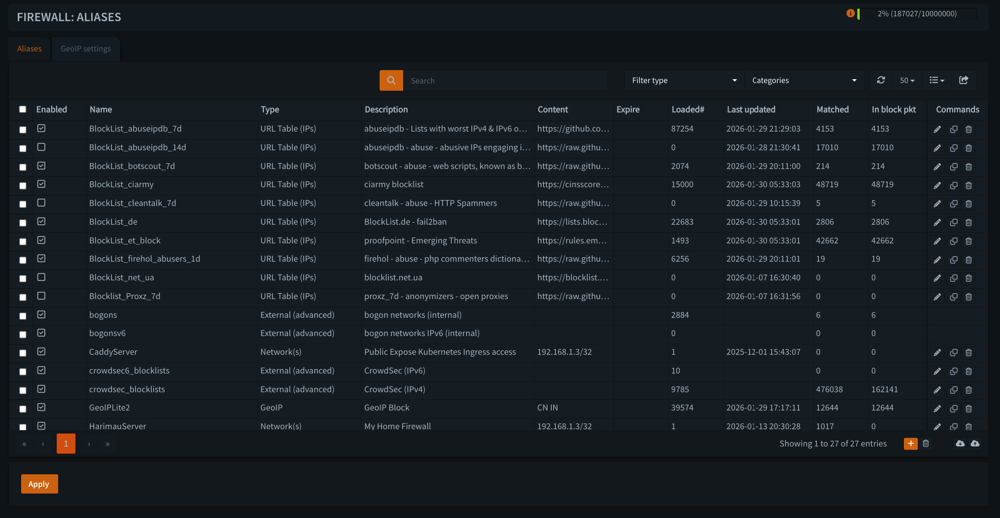

---

# OPNsense Firewall (pf)

```text
                         Internet
                            │
                            ▼
                     ┌─────────────┐
                     │ Cloudflare  │
                     │ Edge Security│
                     └──────┬──────┘
                            │
                            │ HTTPS
                            ▼
┌─────────────────────────────────────────────────┐
│                 OPNsense Firewall               │
│                       (pf)                      │
│                                                 │
│  L3/L4 PERIMETER ENFORCEMENT                    │
│  ─────────────────────────────────────────────  │
│                                                 │
│  • Stateful firewall rules                      │
│  • NAT / port forwarding                        │
│  • Network segmentation                         │
│  • Threat-intelligence aliases                  │
│  • CrowdSec dynamic decisions                   │
│  • Management / VPN access control               │
│                                                 │
│  ✔ Drop prohibited traffic early                │
│  ✔ Enforce network boundaries                   │
│  ✔ Prevent direct origin access                 │
│  ✔ Reduce unnecessary downstream traffic        │
└──────────────────────┬──────────────────────────┘
                       │
                       │ Allowed traffic
                       ▼
                 Caddy Reverse Proxy
                       │
                       ▼
                 Suricata IDS/IPS
                       │
                       ▼
                 Envoy Gateway
                       │
                       ▼
                    Coraza WAF
                       │
                       ▼
                  Kubernetes
```

---

## Overview

OPNsense provides the **network security enforcement layer** for the 2026 architecture.

It is responsible for **Layer 3/Layer 4 firewall enforcement**, stateful packet filtering, NAT, network segmentation, perimeter access control, threat-intelligence filtering, and dynamic CrowdSec enforcement.

OPNsense sits between the external network and the internal infrastructure.

Its primary purpose is to decide whether network traffic is permitted to reach the downstream security and application layers.

OPNsense is **not the HTTP WAF** and is not responsible for application-layer request inspection.

The security responsibilities are deliberately separated:

```text
Cloudflare
    |
    | Edge security
    v
OPNsense / pf
    |
    | Network enforcement
    v
Caddy
    |
    | TLS termination
    v
Suricata
    |
    | Network IDS/IPS
    v
Envoy Gateway
    |
    | HTTP routing
    v
Coraza
    |
    | HTTP WAF
    v
Kubernetes
```

---

## Role in the Security Architecture

OPNsense provides **Layer 3 and Layer 4 enforcement** that complements the other security controls.

| Layer           | Component     | Primary responsibility                           |
| --------------- | ------------- | ------------------------------------------------ |
| Edge            | Cloudflare    | Public-edge filtering and enforcement            |
| L3/L4           | OPNsense / pf | Firewall, NAT, segmentation, network enforcement |
| Reverse Proxy   | Caddy         | TLS termination and proxying                     |
| Network IDS/IPS | Suricata      | Network inspection and IPS enforcement           |
| Gateway         | Envoy Gateway | HTTP routing and gateway control                 |
| WAF             | Coraza        | HTTP-aware application security                  |
| Behavioral      | CrowdSec      | Behavioral detection and security decisions      |
| Observability   | Datadog       | Security and operational telemetry               |

### Why OPNsense remains required

Even with Cloudflare in front:

* Not all traffic is HTTP/S
* Internal network boundaries still require enforcement
* VPN and management access require explicit controls
* Direct-origin access must be restricted
* Network-level threat intelligence can block traffic before downstream services
* CrowdSec decisions require a network enforcement point
* Internal lateral movement must not be implicitly trusted

Cloudflare therefore does not replace the firewall.

---

## Firewall Philosophy

The pf policy follows a least-privilege model.

Core principles:

* **Default deny**
* **Stateful filtering**
* **Explicit allow rules**
* **Least-privilege network access**
* **Minimal NAT exposure**
* **No implicit trust between network segments**
* **Management access restricted separately**
* **Dynamic security decisions enforced at the firewall**

The firewall should make network-level decisions before traffic reaches higher-level security controls whenever practical.

---

## Interface Strategy

The firewall separates external, internal, and management traffic.

Typical interface roles include:

### WAN

Internet-facing interface.

Responsibilities include:

* Receiving Internet traffic
* Applying inbound firewall policy
* Applying NAT and port-forward rules
* Enforcing perimeter blocklists
* Restricting direct origin access

Only explicitly required services should be exposed.

### Internal / LAN

Provides connectivity to internal infrastructure such as:

* Reverse proxies
* Kubernetes nodes
* Application services
* Databases
* Infrastructure services

Access between internal networks should be explicitly controlled.

### Management

Used for:

* Firewall administration
* Infrastructure management
* Administrative services

Management access should be restricted to trusted networks or approved VPN access.

---

## Inbound Traffic Policy

Inbound WAN traffic is **blocked by default**.

Only explicitly permitted traffic is allowed through the firewall.

The intended public application path is:

```text
Internet
   |
   v
Cloudflare
   |
   v
OPNsense
   |
   v
Caddy
```

The firewall should prevent unauthorized direct access to internal services and Kubernetes endpoints.

Where Cloudflare-origin restrictions are used, the firewall may restrict public application ingress to the documented Cloudflare source ranges and required ports.

Example policy:

```text
Allow:
  Required TCP 443
  From:
    Approved Cloudflare origin ranges
  To:
    Caddy

Deny:
  All other unsolicited WAN traffic
```

Any exception to this model should be explicit and documented.

---

## Outbound Traffic Policy

Outbound traffic should be controlled according to operational requirements rather than assuming unrestricted Internet access.

Typical permitted destinations include:

* DNS
* NTP
* OS and package repositories
* Container registries
* Required external APIs
* Cloud services
* Monitoring services

Outbound controls can reduce the impact of compromised workloads by restricting unnecessary destinations and protocols.

Where practical, high-risk management and infrastructure networks should have more restrictive egress policies than general application networks.

---

## NAT Policy

NAT should remain **minimal and explicit**.

Principles:

* Avoid unnecessary port forwards
* Do not expose application pods directly
* Prefer the reverse-proxy architecture
* Keep public entry points limited
* Document every inbound NAT rule
* Remove obsolete forwards

The intended public application path is:

```text
Cloudflare
    |
    v
OPNsense NAT / Firewall
    |
    v
Caddy
```

The firewall should not create alternate paths directly to Kubernetes services.

---

## Threat-Intelligence Blocklists

OPNsense can use external reputation and threat-intelligence feeds to deny known malicious or unwanted sources.

These controls operate at the **pf firewall layer** and can stop traffic before it reaches:

* Caddy
* Suricata
* Envoy Gateway
* Coraza
* Kubernetes workloads

The exact feeds are operational configuration and should be reviewed periodically for:

* Feed quality
* Update frequency
* False positives
* Duplicate coverage
* Stale entries
* Operational usefulness

### Current documented feeds

The current configuration documentation identifies the following feeds:

* GeoIPLite2
* AbuseIPDB
* FireHOL
* CIArmy
* Proofpoint Emerging Threats
* BotScout
* CleanTalk
* Proxz / net_ua / blocklist.de

These should be treated as **threat-intelligence inputs**, not as independently authoritative truth.

A blocklist match should be understood as a firewall policy decision based on the configured feed.

---

## GeoIP Filtering

GeoIP data can be used to classify source addresses and apply network policy.

Possible uses include:

* Restricting management services
* Limiting non-public services
* Applying additional controls to selected regions
* Reducing unwanted automated traffic

GeoIP is inherently approximate and should not be treated as an identity mechanism.

It should therefore complement, rather than replace, authentication and explicit access controls.

---

## CrowdSec Integration

CrowdSec provides **behavioral detection and security decisioning**.

The OPNsense firewall provides the enforcement point for CrowdSec network decisions.

The model is:

```text
Security telemetry
       |
       v
    CrowdSec
       |
       | Behavioral detection
       v
    Decision
       |
       v
OPNsense Firewall Bouncer
       |
       v
       pf
       |
       v
     BLOCK
```

This separates:

```text
Detection
    |
    v
CrowdSec

Enforcement
    |
    v
OPNsense / pf
```

CrowdSec therefore does not need to become an inline packet-inspection engine.

OPNsense remains responsible for applying the resulting network-level block.

---

## Suricata IDS / IPS

Suricata provides a separate **network IDS/IPS layer**.

The current architecture does not treat Suricata as an alert-only sensor.

The request path is:

```text
Caddy
   |
   | TLS terminated
   v
Suricata IDS/IPS
   |
   v
Envoy Gateway
```

Suricata is responsible for:

* Network inspection
* Protocol inspection
* Signature detection
* Security alerts
* IPS enforcement

OPNsense and Suricata therefore have distinct responsibilities.

### OPNsense

```text
L3/L4 policy
Firewall
NAT
Network segmentation
Threat-intelligence blocking
CrowdSec enforcement
```

### Suricata

```text
Network/protocol inspection
Signature detection
IDS
IPS
Security telemetry
```

OPNsense should not be described as the replacement for Suricata, and Suricata should not be described as the replacement for pf.

---

## Direct Origin Protection

The firewall provides an important trust boundary between the public Internet and the internal origin infrastructure.

The intended public path is:

```text
Internet
    |
    v
Cloudflare
    |
    v
OPNsense
    |
    v
Caddy
    |
    v
Suricata
    |
    v
Envoy Gateway
    |
    v
Coraza
    |
    v
Kubernetes
```

Direct Internet access to internal addresses such as the Kubernetes gateway should not be part of the architecture.

This protects against:

* Direct-origin discovery
* Cloudflare bypass attempts
* Unintended service exposure
* Accidental port forwarding
* Exposure of internal administrative services

---

## Network Segmentation

OPNsense should enforce boundaries between network zones.

Examples include:

```text
WAN
 |
 +-- Public ingress
 |
 +-- VPN
 |
 +-- Management
 |
 +-- Kubernetes
 |
 +-- Infrastructure
 |
 +-- Application / service networks
```

A service being reachable from one network does not imply that it should be reachable from another.

Inter-zone access should be explicitly defined.

---

## Logging & Visibility

OPNsense should provide telemetry for:

* Allowed connections where useful
* Blocked connections
* NAT activity
* Firewall rule matches
* Dynamic CrowdSec blocks
* Threat-intelligence blocks
* Administrative activity
* Interface and gateway health
* Security-related events

Logs should be available to the central observability platform where appropriate.

The purpose is to support:

* Incident investigation
* Threat hunting
* Rule tuning
* False-positive analysis
* Operational troubleshooting
* Security auditing
* Correlation with Cloudflare, Caddy, Suricata, Envoy, Coraza, and CrowdSec

---

## Production Monitoring

The firewall itself is a critical control plane and should be monitored independently of application workloads.

Important signals include:

* Firewall availability
* Interface state
* Gateway health
* Packet loss
* NAT failures
* Rule reload failures
* Blocklist update failures
* CrowdSec bouncer health
* Unexpected configuration changes
* Excessive blocked traffic
* Excessive state-table usage
* Resource exhaustion

Security controls should fail in an observable way.

---

## Defense-in-Depth Model

The complete request path is:

```text
                    INTERNET
                        |
                        v
                  +-----------+
                  | Cloudflare|
                  +-----------+
                        |
                        v
                  +-----------+
                  | OPNsense  |
                  |    pf     |
                  +-----------+
                        |
                        v
                  +-----------+
                  |   Caddy   |
                  | TLS Term. |
                  +-----------+
                        |
                        v
                  +-----------+
                  | Suricata  |
                  |  IDS/IPS  |
                  +-----------+
                        |
                        v
                  +-----------+
                  |   Envoy   |
                  |  Gateway  |
                  +-----------+
                        |
                        v
                  +-----------+
                  |  Coraza   |
                  |    WAF    |
                  +-----------+
                        |
                        v
                  +-----------+
                  | Kubernetes|
                  +-----------+
```

Behavioral enforcement operates independently:

```text
             Network / Application Telemetry
                         |
                         v
                      CrowdSec
                         |
                         v
                      Decision
                         |
              +----------+----------+
              |                     |
              v                     v
          OPNsense              Cloudflare
             / pf               enforcement
```

Each control therefore has a distinct responsibility.

---

## Security Principles

### Default deny

Unsolicited traffic should be denied unless explicitly permitted.

### Least privilege

Allow only the traffic required for the service or network relationship.

### Enforce early

Known prohibited network traffic should be dropped before it reaches more expensive downstream controls where practical.

### Do not confuse detection with enforcement

The architecture separates:

```text
Detection
    |
    +-- Suricata
    +-- CrowdSec
    +-- Threat intelligence

Enforcement
    |
    +-- OPNsense / pf
    +-- Suricata IPS
    +-- Cloudflare
    +-- Coraza
```

Different controls may both detect and enforce, but their responsibilities remain distinct.

### Preserve defense in depth

No single security layer should be treated as sufficient by itself.

### Keep exceptions explicit

Firewall exceptions, NAT rules, aliases, and bypasses should be documented and reviewed.

### Keep security observable

A firewall block, CrowdSec ban, Suricata IPS action, or configuration failure should be visible to operators.

---

## Operational Maintenance

Firewall configuration should be maintained through a controlled operational process.

Important practices include:

* Regular rule review
* Threat-feed review
* Blocklist validation
* CrowdSec bouncer monitoring
* Suricata rule tuning
* Configuration backups
* Configuration change tracking
* Documented exceptions
* Recovery testing
* Periodic review of exposed services

Firewall configuration backups are particularly important because the firewall is part of the infrastructure control plane.

---

## Current Architecture

The 2026 network security architecture is:

```text
Internet
   |
   v
Cloudflare
   |
   v
OPNsense / pf
   |
   v
Caddy
   |
   v
Suricata IDS/IPS
   |
   v
Envoy Gateway
   |
   v
Coraza WAF
   |
   v
Kubernetes
```

OPNsense is responsible for the **network boundary**.

It does not replace the application security layers downstream.

---

## Summary

OPNsense provides the **L3/L4 network enforcement boundary** for the 2026 architecture.

Its responsibilities include:

* Stateful firewall enforcement
* NAT
* Network segmentation
* Inbound and outbound policy
* Threat-intelligence filtering
* Direct-origin protection
* CrowdSec decision enforcement
* Network security logging

The overall separation of responsibilities is:

> **Cloudflare protects and filters at the public edge.**

> **OPNsense enforces network policy and perimeter access.**

> **Caddy terminates TLS and proxies traffic.**

> **Suricata detects and blocks network-level threats.**

> **Envoy Gateway routes HTTP traffic.**

> **Coraza enforces HTTP WAF policy.**

> **CrowdSec correlates behavior and creates security decisions.**

> **Datadog provides centralized observability.**

The firewall's role is deliberately narrow:

> **Enforce network policy, protect the origin, and provide a controlled L3/L4 boundary for the security architecture.**
