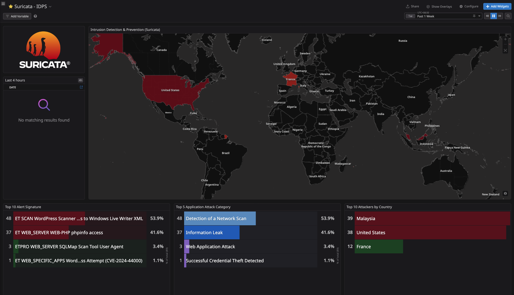

---

# Suricata — 2026 Network IDS / IPS

Suricata provides **network-level intrusion detection and prevention** for the 2026 network security architecture.

In the 2026 architecture, Suricata is positioned **after TLS termination**, allowing it to inspect the decrypted traffic flowing toward the Kubernetes ingress layer.

Suricata operates as both:

* **IDS** — detects suspicious traffic and generates alerts
* **IPS** — actively blocks traffic matching configured IPS rules

Suricata is therefore an enforcement layer, but it is **not the primary HTTP WAF**. HTTP-aware application filtering remains the responsibility of Coraza running with Envoy Gateway.

---

## 🏗️ Architecture

```text
Internet
   |
   v
Cloudflare
   |
   v
OPNsense Firewall
(pf + blocklists + CrowdSec)
   |
   v
Caddy Reverse Proxy
(TLS termination)
   |
   | Decrypted HTTP
   v
+--------------------------------------+
|              SURICATA                |
|            IDS + IPS                 |
|                                      |
|  - Network inspection                |
|  - Protocol inspection               |
|  - Signature detection               |
|  - Threat detection                  |
|  - Alert generation                  |
|  - Inline prevention                 |
+--------------------+-----------------+
                     |
                     v
             Envoy Gateway + Coraza
             HTTP routing + WAF
                     |
                     v
             Kubernetes Services / Pods
```

The important architectural distinction is that **Suricata is an active IDS/IPS layer**, while Coraza remains the HTTP-aware WAF.

Suricata can detect and block traffic before it reaches Envoy Gateway when a matching IPS rule is configured for prevention.

---

## 🎯 Role of Suricata

Suricata provides **network-level detection and prevention**.

Its responsibilities include:

* Detecting malicious network traffic
* Detecting known attack signatures
* Identifying scanners and exploit attempts
* Inspecting HTTP traffic after TLS termination
* Generating security telemetry
* Blocking traffic matched by IPS rules
* Providing network-level context to the other security layers

Suricata sits between Caddy and Envoy Gateway.

This provides an additional inspection and enforcement point before application-layer WAF processing.

### Suricata is not the WAF

Suricata and Coraza have different responsibilities.

**Suricata:**

* Network IDS/IPS
* Signature-based detection
* Protocol inspection
* Threat detection
* Network-level prevention
* Flow and protocol visibility

**Coraza:**

* HTTP WAF
* OWASP CRS
* HTTP request semantics
* Application-layer policy
* WAF-specific request blocking

This separation keeps each security layer focused on its intended purpose.

---

## 🔍 What Suricata Can See

Caddy terminates TLS before traffic reaches the Suricata inspection point.

Therefore, Suricata can inspect the **decrypted HTTP traffic available at that observation point**, rather than the original encrypted HTTPS payload.

Depending on protocol parsing, stream reassembly, rules, and inspection configuration, Suricata can inspect information such as:

* HTTP methods
* URLs and paths
* Query parameters
* HTTP headers
* Request metadata
* Request payloads
* Response metadata
* Flow information
* Protocol anomalies
* Signature matches

For example:

```text
GET /.env HTTP/1.1
Host: example.crytera.com
User-Agent: scanner
```

can be visible to Suricata as HTTP rather than as encrypted TLS payload.

This allows network signatures to detect application-layer attack indicators that would otherwise be hidden from a network sensor positioned before TLS termination.

### Important distinction

Suricata's visibility depends on:

* Protocol parsers
* Stream reassembly
* Rule configuration
* Inspection settings
* Traffic visibility at the inspection point

It should therefore **not** be treated as an unrestricted replacement for an HTTP WAF.

Coraza remains responsible for HTTP-aware WAF policy.

---

## 🚨 Detection and Prevention

Suricata can detect and block traffic matching configured signatures.

Examples include:

* Sensitive file probes
* Known exploit attempts
* Scanner activity
* Command injection patterns
* Malformed HTTP requests
* Protocol anomalies
* Known CVE exploitation
* Suspicious payloads
* Other signature-defined malicious traffic

A simplified flow is:

```text
HTTP request
     |
     v
Suricata inspection
     |
     +---- No match --------> Envoy Gateway
     |
     +---- Alert rule ------> Alert / telemetry
     |
     +---- IPS rule --------> BLOCK
```

The exact action depends on the configured Suricata rule and IPS operating mode.

Not every Suricata alert is necessarily a blocking event.

The important distinction is:

> **Detection and prevention are both enabled, but enforcement is rule-driven.**

---

## 🛡️ Operating Mode

| Setting                 | 2026 Configuration                                        |
| ----------------------- | --------------------------------------------------------- |
| Detection               | Enabled                                                   |
| IDS                     | Enabled                                                   |
| IPS                     | Enabled                                                   |
| Inline inspection       | Enabled                                                   |
| Alert generation        | Enabled                                                   |
| Packet blocking         | Enabled                                                   |
| Connection interruption | Enabled when triggered by IPS rules                       |
| TLS inspection          | After upstream TLS termination                            |
| HTTP inspection         | Enabled where supported by protocol parsing/configuration |

Suricata therefore participates directly in traffic enforcement.

A matching IPS rule can prevent traffic from continuing toward Envoy Gateway.

### IPS topology

The exact IPS mechanism should be documented according to the deployed Suricata integration, including whether prevention is implemented through an inline bridge, NFQUEUE, AF_PACKET IPS, or another supported mechanism.

The critical requirement is that the deployed topology provides an actual enforcement path rather than merely generating alerts.

---

## 🔥 Why Suricata Can Block

The 2026 design deliberately uses Suricata as an additional enforcement layer.

The traffic path is:

```text
Cloudflare
    |
    v
OPNsense
    |
    v
Caddy
    |
    v
Suricata
    |
    +---- malicious signature ----> BLOCK
    |
    v
Envoy Gateway
    |
    v
Coraza
    |
    v
Kubernetes
```

This provides multiple independent opportunities to stop malicious traffic.

### Edge enforcement

Cloudflare handles threats that can be filtered or challenged at the public edge.

### Network enforcement

OPNsense and its CrowdSec integration handle network-level bans and perimeter enforcement.

### Network IDS/IPS

Suricata detects and blocks traffic matching configured network security signatures.

### Application WAF

Coraza provides HTTP-aware WAF enforcement at Envoy Gateway.

The layers therefore complement each other rather than replacing one another.

---

## 🌐 Real Client Identity

The original client may be behind Cloudflare.

The HTTP request can therefore contain Cloudflare-provided headers such as:

```text
CF-Connecting-IP
CF-IPCountry
X-Forwarded-For
```

Caddy is responsible for handling and propagating trusted client identity through the reverse-proxy chain.

Suricata can inspect these HTTP headers once traffic is decrypted.

This can provide useful context for:

* Security investigation
* Alert correlation
* Log analysis
* Incident response
* Correlation with CrowdSec decisions

### Trust boundary

These headers must **not** be blindly trusted from arbitrary clients.

The architecture relies on the request arriving through the controlled:

```text
Cloudflare
    ↓
OPNsense
    ↓
Caddy
    ↓
Suricata
    ↓
Envoy Gateway
```

path.

The actual network source address and the application-level client identity represented by an HTTP header are separate pieces of information and should not be conflated.

---

## 🚫 What Suricata Does Not Replace

Suricata is not intended to replace the other security controls.

### Cloudflare

Provides:

* Public-edge filtering
* Managed challenges
* Edge enforcement
* DDoS protection
* Public traffic normalization

### OPNsense

Provides:

* Firewall policy
* NAT
* Network filtering
* Blocklists
* CrowdSec firewall enforcement

### Caddy

Provides:

* TLS termination
* Reverse proxying
* Controlled upstream access
* Client identity propagation
* Access logging

### Coraza

Provides:

* HTTP WAF inspection
* OWASP CRS
* Application-aware request filtering
* HTTP-specific blocking

### CrowdSec

Provides:

* Behavioral detection
* Correlation over time
* Security decisions
* Automated enforcement through bouncers

### Suricata

Provides:

* Network IDS
* Network IPS
* Protocol inspection
* Signature-based detection
* Inline prevention
* Network security telemetry

---

## 🧠 Suricata vs Coraza

The two layers intentionally overlap in some areas, but they operate differently.

| Capability              | Suricata | Coraza |
| ----------------------- | -------: | -----: |
| Network IDS             |        ✅ |      ❌ |
| Network IPS             |        ✅ |      ❌ |
| Protocol inspection     |        ✅ |      ❌ |
| HTTP inspection         |        ✅ |      ✅ |
| HTTP WAF                |        ❌ |      ✅ |
| OWASP CRS               |        ❌ |      ✅ |
| Signature detection     |        ✅ |      ✅ |
| Application-aware rules |  Limited |      ✅ |
| Network flow visibility |        ✅ |      ❌ |
| Inline blocking         |        ✅ |      ✅ |

A malicious request may therefore be detected by Suricata and/or Coraza.

That is intentional.

Independent security controls provide defense in depth.

---

## 🔄 Relationship With CrowdSec

CrowdSec and Suricata solve different problems.

Suricata primarily evaluates **individual network events and protocol/signature matches**.

CrowdSec evaluates **behavior over time** and can make decisions based on repeated activity.

For example:

```text
                    Request
                       |
                       v
                   Suricata
                       |
              +--------+--------+
              |                 |
           Match            No match
              |                 |
              v                 v
            BLOCK             Envoy
                                |
                                v
                              Coraza
                                |
                                v
                         Application telemetry
                                |
                                v
                             CrowdSec
                                |
                                v
                       Behavioral detection
                                |
                                v
                         Decision / Ban
```

The exact telemetry and enforcement path depends on the CrowdSec deployment.

The architectural distinction remains:

> **Suricata detects and prevents network-level signatures. CrowdSec correlates behavior and creates security decisions.**

---

## 📜 Logging & Telemetry

Suricata provides security telemetry such as:

* Alerts
* Signature identifiers
* Rule metadata
* Source and destination information
* Protocol information
* Flow identifiers
* HTTP metadata
* Detection timestamps
* IPS actions
* Packet/flow context where configured

These events can be forwarded into the monitoring and logging stack.

They can be used for:

* Incident investigation
* Security correlation
* Rule tuning
* Threat hunting
* False-positive analysis
* Detection engineering
* Correlation with Cloudflare, Caddy, Envoy, Coraza, and CrowdSec telemetry

Suricata logs are therefore both an enforcement record and an important source of security visibility.

### Production monitoring

The Suricata control plane should also be monitored for:

* Engine health
* Rule loading failures
* Rule-update failures
* IPS drop activity
* Excessive alert rates
* Interface health
* Capture failures
* Unexpected process restarts

Security enforcement should never become an unobserved failure point.

---

## 🧪 Example: Sensitive File Probe

A request such as:

```text
GET /.env HTTP/1.1
Host: example.crytera.com
```

can move through the security stack as follows:

```text
Cloudflare
    |
    v
OPNsense
    |
    v
Caddy
    |
    | HTTPS terminated
    v
Suricata
    |
    | Signature match
    |
    +----> IPS BLOCK
```

If the request does not match a blocking Suricata rule, it continues:

```text
Suricata
    |
    v
Envoy Gateway
    |
    v
Coraza
    |
    +----> WAF decision
    |
    v
Kubernetes
```

This provides independent detection and enforcement points.

---

## 🧪 Example: Repeated HTTP Abuse

A different situation may not trigger a Suricata signature immediately.

For example:

```text
Client
  |
  +-- GET /missing
  +-- GET /missing
  +-- GET /missing
  +-- GET /admin
  +-- GET /login
  +-- ...
```

Suricata may observe the individual HTTP traffic without treating every request as a signature-level IPS event.

The traffic can then reach the application layer, where Envoy, Coraza, and access logging provide additional telemetry.

CrowdSec can correlate repeated behavior over time and create a security decision.

This illustrates why Suricata and CrowdSec are complementary rather than interchangeable.

---

## 🧱 Defense-in-Depth Model

The 2026 security path is intentionally layered:

```text
                     INTERNET
                         |
                         v
                  +-----------+
                  | Cloudflare|
                  +-----------+
                         |
                         v
                  +-----------+
                  | OPNsense  |
                  |    pf     |
                  +-----------+
                         |
                         v
                  +-----------+
                  |   Caddy   |
                  | TLS Term. |
                  +-----------+
                         |
                    Decrypted HTTP
                         |
                         v
                  +-----------+
                  | Suricata  |
                  |  IDS/IPS  |
                  +-----------+
                         |
                         v
                  +-----------+
                  |   Envoy   |
                  |  Gateway  |
                  +-----------+
                         |
                         v
                  +-----------+
                  |  Coraza   |
                  |    WAF    |
                  +-----------+
                         |
                         v
                  +-----------+
                  | Kubernetes|
                  +-----------+
```

Behavioral security operates independently:

```text
       Network / Application Telemetry
                     |
                     v
                  CrowdSec
                     |
                     v
                  Decision
                     |
              +------+------+
              |             |
              v             v
         Cloudflare     OPNsense
         enforcement       / pf
```

Each layer therefore contributes its own detection or enforcement capability.

---

## 🧠 Design Principles

The Suricata deployment follows several principles.

### Detect broadly, block deliberately

Suricata can observe a wide range of traffic, but blocking should be based on appropriate IPS rules rather than indiscriminate packet dropping.

### Use the right layer

Suricata handles network/protocol-level detection and prevention.

Coraza handles HTTP WAF policy.

CrowdSec handles behavioral correlation.

### Preserve defense in depth

A request should not depend on a single security mechanism.

Multiple independent layers provide additional opportunities for detection and enforcement.

### Protect application availability

IPS rules must be monitored for false positives.

A legitimate application request incorrectly matched by an IPS rule can be just as operationally significant as an application WAF false positive.

Production IPS operation should therefore include:

* Rule review
* Controlled rule updates
* False-positive monitoring
* Exception handling
* Change management
* Rollback procedures

### Keep enforcement observable

When Suricata blocks traffic, the event should be visible in security telemetry so that the action can be investigated and tuned.

---

## 📊 Relationship to Other Security Layers

| Layer             | Primary Responsibility                       |
| ----------------- | -------------------------------------------- |
| **Cloudflare**    | Edge filtering, challenges, edge enforcement |
| **OPNsense / pf** | Firewall and network enforcement             |
| **Caddy**         | TLS termination and reverse proxy            |
| **Suricata**      | Network IDS/IPS                              |
| **Envoy Gateway** | Kubernetes gateway and HTTP routing          |
| **Coraza**        | HTTP WAF and OWASP CRS                       |
| **CrowdSec**      | Behavioral detection and automated decisions |
| **Kubernetes**    | Application workloads and business logic     |

The architecture intentionally avoids making Suricata responsible for every type of security decision.

---

## 📡 Request Path vs Telemetry Path

The primary request path is:

```text
Internet
   |
   v
Cloudflare
   |
   v
OPNsense
   |
   v
Caddy
   |
   v
Suricata IDS/IPS
   |
   v
Envoy Gateway
   |
   v
Coraza WAF
   |
   v
Kubernetes
```

Security telemetry is collected independently:

```text
Cloudflare ───────────────┐
OPNsense ─────────────────┤
Caddy ────────────────────┤
Suricata ─────────────────┤
Envoy ────────────────────┼──> Datadog
Coraza ──────────────────┤
CrowdSec #1 ──────────────┤
CrowdSec #2 ──────────────┘
```

This distinction is important.

**Datadog observes the security system; it is not itself an enforcement layer.**

---

## ⚠️ Failure and Availability Considerations

Suricata is part of the production request path and therefore must be treated as an availability-sensitive security control.

The deployment should explicitly define:

* What happens if the Suricata engine stops
* What happens if packet capture fails
* What happens if IPS rules fail to load
* Whether traffic fails open or fails closed
* How Suricata health is monitored
* How IPS failures are alerted
* How the service is recovered
* How rule changes are rolled back

The appropriate failure behavior depends on the operational requirements of the environment.

The important requirement is that the behavior is **intentional, documented, monitored, and tested**.

---

## 🔐 Rule Management

Production IPS operation requires controlled rule management.

Rules should be:

* Versioned
* Updated through a controlled process
* Monitored for false positives
* Tested before broad enforcement where practical
* Tuned using documented exceptions
* Observable through alert and block telemetry

A rule update should not silently change the availability characteristics of the production traffic path.

---

## ✅ Summary

Suricata is a **network IDS/IPS** positioned after TLS termination and before Envoy Gateway.

It provides:

* Network visibility
* Protocol visibility
* Signature-based detection
* Security telemetry
* Inline prevention
* Defense-in-depth enforcement

The 2026 architecture is therefore:

> **Cloudflare filters at the edge.**

> **OPNsense enforces network policy.**

> **Caddy terminates TLS and proxies traffic.**

> **Suricata detects and blocks network-level threats.**

> **Envoy Gateway routes the traffic.**

> **Coraza enforces HTTP WAF policy.**

> **CrowdSec correlates behavior and creates automated decisions.**

Suricata is not simply a passive sensor.

**It is an active IDS/IPS enforcement layer in the 2026 architecture.**
