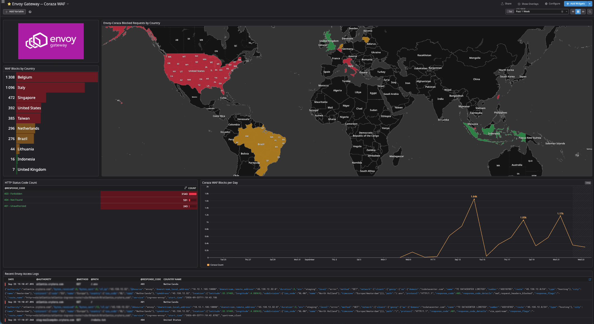

---

# Envoy Gateway + Coraza — 2026

**Envoy Gateway** provides the Kubernetes Gateway API and HTTP routing layer for the 2026 network security architecture.

**Coraza** provides the application-layer Web Application Firewall (WAF), using the **OWASP Core Rule Set (CRS)** to inspect HTTP requests and enforce application-layer security policy.

Together they replace the previous:

```text
NGINX Ingress Controller
        +
ModSecurity v3
        +
OWASP CRS
```

architecture.

The 2026 Kubernetes ingress model is:

```text
                         Suricata IDS / IPS
                         Post-TLS inspection
                                |
                                v
                    +---------------------------+
                    |       Envoy Gateway       |
                    |                           |
                    |   Kubernetes Gateway API  |
                    |   HTTP listeners          |
                    |   HTTP routing            |
                    |   Service selection       |
                    +-------------+-------------+
                                  |
                                  v
                    +---------------------------+
                    |          Coraza            |
                    |                           |
                    |        HTTP WAF            |
                    |        OWASP CRS           |
                    |        Request blocking    |
                    +-------------+-------------+
                                  |
                                  v
                         Kubernetes Services
                                  |
                                  v
                            Pods / Apps
```

The responsibilities are intentionally separated:

> **Envoy Gateway routes. Coraza protects HTTP. Suricata protects the network.**

---

## 🏗️ Architecture

The complete public request path is:

```text
Internet
   |
   v
Cloudflare
   |
   v
OPNsense Firewall
   |
   v
Caddy Reverse Proxy
   |
   | TLS termination
   | decrypted HTTP
   v
Suricata IDS / IPS
   |
   | network / protocol inspection
   v
Envoy Gateway
   |
   | Gateway API routing
   v
Coraza WAF
   |
   | OWASP CRS inspection
   v
Kubernetes Services
   |
   v
Application Pods
```

This architecture separates the security responsibilities by layer:

| Component         | Responsibility                          |
| ----------------- | --------------------------------------- |
| Cloudflare        | Edge filtering and enforcement          |
| OPNsense          | Firewall / network policy               |
| Caddy             | TLS termination and reverse proxy       |
| Suricata          | Network IDS/IPS                         |
| **Envoy Gateway** | Kubernetes Gateway API and HTTP routing |
| **Coraza**        | HTTP WAF / OWASP CRS                    |
| CrowdSec          | Behavioral detection and decisioning    |
| Kubernetes        | Application workloads                   |

---

# 🚀 Envoy Gateway

Envoy Gateway provides the Kubernetes-facing gateway layer.

Unlike the previous NGINX Ingress deployment, the 2026 architecture uses the **Kubernetes Gateway API** with Envoy Gateway.

Envoy Gateway is responsible for:

* Gateway API implementation
* Gateway and listener configuration
* HTTP request handling
* Host-based routing
* Path-based routing
* Service selection
* Upstream connection handling
* Gateway policy enforcement
* Structured access telemetry
* Integration with application-layer security controls

Envoy Gateway is the **gateway and routing layer**, not the WAF.

Conceptually:

```text
HTTP request
     |
     v
Envoy Gateway
     |
     +---- listener
     |
     +---- HTTPRoute
     |
     +---- policy
     |
     +---- WAF integration
     |
     v
Kubernetes Service
```

---

# 🌐 Gateway API

The ingress architecture is based on Kubernetes Gateway API resources rather than the previous ingress-nginx model.

The main concepts are:

```text
GatewayClass
     |
     v
Gateway
     |
     v
Listener
     |
     v
HTTPRoute
     |
     v
Service
     |
     v
Pod
```

### GatewayClass

Defines which gateway implementation manages the Gateway.

### Gateway

Defines the Kubernetes-facing gateway and its listeners.

### Listener

Defines the address/port/protocol/hostname combinations accepted by the gateway.

### HTTPRoute

Defines how HTTP requests are mapped to backend services.

This provides a cleaner separation between:

* infrastructure ownership
* gateway configuration
* application routing
* service ownership

---

# 🛡️ Coraza Web Application Firewall

Coraza provides HTTP-aware WAF enforcement.

It replaces the previous:

```text
ModSecurity v3
      +
OWASP CRS
```

implementation.

The WAF operates on HTTP traffic after TLS has been terminated upstream.

Typical attack classes include:

* SQL injection
* Cross-site scripting
* Command injection
* Remote-code-execution patterns
* Path traversal
* Sensitive file discovery
* Malformed HTTP requests
* Known exploit patterns
* Scanner payloads
* Other OWASP CRS detections

A matching request can be rejected before reaching the application workload.

Typical flow:

```text
HTTP request
     |
     v
Envoy Gateway
     |
     v
Coraza
     |
     +---- CRS match ----> HTTP 403
     |
     v
Kubernetes Service
```

Coraza therefore provides **application-layer enforcement**.

---

# 🔥 WAF Enforcement

Coraza is positioned so that the request can be evaluated using HTTP semantics before it reaches the application workload.

For example:

```http
GET /index.php?id=1' OR '1'='1
```

can be evaluated as an HTTP request rather than as an opaque encrypted network payload.

A WAF match can result in:

```text
HTTP 403 Forbidden
```

instead of forwarding the request to the application.

The important distinction is:

```text
Suricata
    |
    +-- Network / protocol threat
    |
    +-- IDS/IPS enforcement


Coraza
    |
    +-- HTTP / application threat
    |
    +-- WAF enforcement
```

---

# 🔍 Envoy Gateway vs Coraza

These components have different responsibilities.

| Capability              |       Envoy Gateway | Coraza |
| ----------------------- | ------------------: | -----: |
| Kubernetes Gateway API  |                   ✅ |      ❌ |
| Gateway listeners       |                   ✅ |      ❌ |
| HTTP routing            |                   ✅ |      ❌ |
| Service selection       |                   ✅ |      ❌ |
| Reverse proxy           |                   ✅ |      ❌ |
| HTTP processing         |                   ✅ |      ✅ |
| WAF                     |                   ❌ |      ✅ |
| OWASP CRS               |                   ❌ |      ✅ |
| HTTP payload inspection |             Limited |      ✅ |
| WAF blocking            | Via WAF integration |      ✅ |
| Gateway policy          |                   ✅ |      ❌ |

The separation is intentional:

> **Envoy determines where traffic goes. Coraza determines whether the HTTP request is permitted through the WAF policy.**

---

# 🌐 Network & Client Identity

The gateway receives traffic through the controlled proxy chain:

```text
Cloudflare
    |
    v
OPNsense
    |
    v
Caddy
    |
    v
Suricata
    |
    v
Envoy Gateway
```

The original client identity may be represented through trusted proxy metadata such as:

```text
CF-Connecting-IP
X-Forwarded-For
CF-IPCountry
```

These headers must **not** automatically be treated as authoritative when received directly from an untrusted client.

The trusted proxy chain must be explicitly defined.

Correct client attribution is important for:

* WAF logs
* Security investigation
* Rate limiting
* CrowdSec behavioral analysis
* Geographic analysis
* Incident correlation
* Datadog dashboards

The security model is therefore:

```text
Internet client
      |
      | untrusted headers
      v
Cloudflare
      |
      | trusted proxy metadata
      v
OPNsense
      |
      v
Caddy
      |
      v
Envoy
```

Only the controlled proxy chain should be permitted to establish authoritative client identity.

---

# 📜 Logging & Observability

Envoy Gateway produces structured access telemetry for requests passing through the gateway.

Relevant information can include:

* Client address
* HTTP method
* Host
* Request path
* Query information
* Response status
* Request duration
* User-Agent
* Forwarded client information
* Upstream information
* Route information
* Gateway response information

Coraza can additionally provide WAF-specific telemetry such as:

* Rule ID
* Rule message
* Detection category
* Anomaly score
* WAF action
* Request metadata
* Blocking decision

Conceptually:

```text
Client
  |
  v
Envoy
  |
  v
Coraza
  |
  +---- WAF block ----> 403
  |
  v
Kubernetes Service
```

Both gateway and WAF telemetry should be available to the central observability layer.

```text
Envoy Gateway
      |
      +---- access logs --------+
                                |
Coraza                          |
      |                         |
      +---- WAF events ---------+----> Datadog
```

---

# 🔄 CrowdSec Integration

Envoy Gateway access logs provide application-level behavioral telemetry for **CrowdSec #2**.

CrowdSec can correlate repeated behavior such as:

```text
401 Unauthorized
403 Forbidden
404 Not Found
```

and other application-level indicators over time.

The architecture is:

```text
              Envoy Gateway
                    |
                    v
              Access logs
                    |
                    v
                CrowdSec
                    |
                    v
            Behavioral detection
                    |
                    v
                 Decision
                    |
                    v
          Cloudflare Worker / KV
                    |
                    v
              Cloudflare BLOCK
```

CrowdSec is **not inline with Envoy**.

It observes application behavior and creates a decision when configured behavioral criteria are met.

This is deliberately different from Coraza.

### Coraza asks:

> **Does this individual HTTP request violate WAF policy?**

### CrowdSec asks:

> **Does this source demonstrate abusive behavior over time?**

This allows both controls to operate on the same traffic without duplicating responsibilities.

---

# 🧱 Defense in Depth

The 2026 architecture provides multiple independent security controls:

```text
Internet
   |
   v
Cloudflare
   |
   | Edge enforcement
   v
OPNsense
   |
   | Firewall enforcement
   v
Caddy
   |
   | TLS termination
   v
Suricata
   |
   | Network IDS/IPS
   v
Envoy Gateway
   |
   | Gateway / routing
   v
Coraza
   |
   | HTTP WAF enforcement
   v
Kubernetes
   |
   v
Application
```

Separately:

```text
Envoy telemetry
      |
      v
CrowdSec #2
      |
      | Behavioral correlation
      v
Decision
      |
      v
Cloudflare Worker / KV
      |
      v
Cloudflare BLOCK
```

Each layer uses information appropriate to its role.

---

# 🔐 Why Coraza Exists Separately from Suricata

Some attacks are best handled after the request has been interpreted as HTTP.

Examples include:

* SQL injection payloads
* XSS payloads
* Path traversal
* Command injection
* Malicious request bodies
* Known HTTP exploit patterns
* Sensitive-file probes

Suricata and Coraza therefore operate at different semantic layers.

```text
Network / protocol threat
          |
          v
       Suricata
```

versus:

```text
HTTP / application threat
          |
          v
        Coraza
```

Suricata can inspect the decrypted HTTP traffic available at its observation point, subject to protocol parsing, stream reassembly, IPS topology, and rule configuration.

Coraza has direct access to the HTTP request semantics required for WAF policy.

This is defense in depth rather than duplicate functionality.

---

# 🧪 Example: `/.env`

A sensitive-file request may pass through multiple controls.

```http
GET /.env HTTP/1.1
Host: example.crytera.com
```

The request path is:

```text
Cloudflare
    |
    v
OPNsense
    |
    v
Caddy
    |
    v
Suricata
    |
    | Network / protocol inspection
    v
Envoy Gateway
    |
    v
Coraza
    |
    | WAF rule match
    |
    +----> 403 Forbidden
```

If Coraza blocks the request, the Kubernetes application does not receive it.

Datadog can then correlate:

```text
Envoy request
      +
Coraza rule match
      +
HTTP 403
```

---

# 🧪 Example: Repeated 404 Scanning

Consider a source repeatedly requesting nonexistent paths:

```text
GET /admin
GET /wp-login.php
GET /phpmyadmin
GET /random-file
GET /backup.zip
GET /.git/config
```

Individual requests may not all trigger the same WAF rule.

However, the sequence can provide behavioral telemetry for CrowdSec.

```text
Requests
   |
   v
Envoy Gateway
   |
   v
Access logs
   |
   v
CrowdSec #2
   |
   | repeated abusive behavior
   v
Decision
   |
   v
Cloudflare Worker / KV
   |
   v
Cloudflare BLOCK
```

This complements Coraza rather than replacing it.

---

# ⚖️ Detection vs Enforcement

The security architecture deliberately separates detection, decisioning, and enforcement.

| Component     | Detection |     Decision |          Enforcement |
| ------------- | --------: | -----------: | -------------------: |
| Cloudflare    |         ✅ |            ✅ |                    ✅ |
| OPNsense      |         ✅ |            ✅ |                    ✅ |
| Suricata      |         ✅ |  Rule-driven |                ✅ IPS |
| Caddy         | Telemetry |            ❌ |                Proxy |
| Envoy Gateway | Telemetry |            ❌ |              Routing |
| Coraza        |         ✅ | Rule/anomaly |                ✅ WAF |
| CrowdSec #1   |         ✅ |            ✅ |     OPNsense bouncer |
| CrowdSec #2   |         ✅ |            ✅ | Cloudflare Worker/KV |
| Datadog       | ✅ Observe |            ❌ |                    ❌ |

This distinction is important operationally.

> **Envoy routes. Coraza enforces HTTP policy. Suricata enforces network policy. CrowdSec correlates behavior and creates decisions.**

---

# 🛠️ WAF Policy & Tuning

OWASP CRS should be treated as a managed security policy rather than an immutable collection of rules.

Production operation should include:

* CRS version tracking
* Coraza version tracking
* Rule version tracking
* Anomaly-score configuration
* Paranoia-level configuration
* Local exclusions
* Application-specific exclusions
* Custom rules where required
* False-positive monitoring
* Controlled upgrades
* Validation before production rollout

WAF exceptions should be as narrow as possible.

A legitimate application request should not result in a broad rule disablement when a more specific exclusion can solve the issue.

The preferred model is:

```text
CRS rule
   |
   v
False positive?
   |
   +---- No ----> Keep rule
   |
   +---- Yes
          |
          v
     Identify exact
     application/path
          |
          v
     Narrow exclusion
```

---

# 🔐 Gateway Security Principles

### Least-privilege routing

Only explicitly configured Gateway API routes should expose Kubernetes services.

### No implicit trust

Forwarded client identity must only be trusted through the known proxy chain.

### Explicit listeners

Gateway listeners should expose only the required protocols, ports, and hostnames.

### Controlled upstream access

The gateway should only route to intended Kubernetes Services.

### Defense in depth

Cloudflare, OPNsense, Suricata, Coraza, and CrowdSec provide different security controls.

### Separation of responsibility

Envoy Gateway provides:

* Gateway API
* HTTP listeners
* Routing
* Upstream selection

Coraza provides:

* HTTP inspection
* OWASP CRS
* WAF enforcement

Suricata provides:

* Network inspection
* IDS/IPS enforcement

CrowdSec provides:

* Behavioral detection
* Decisioning
* Delegated enforcement

---

# 🚨 Failure & Availability Considerations

The gateway and WAF are part of the application request path and therefore require explicit failure behavior.

The deployment should define:

* What happens when Envoy is unavailable
* What happens when Coraza is unavailable
* What happens when WAF configuration fails
* What happens when upstream Services are unavailable
* How failed requests are surfaced
* How security-control failures are monitored

Security enforcement should not silently disappear because a configuration or integration failed.

At the same time, availability policy should be explicitly defined rather than relying on an undocumented implicit fail-open or fail-closed behavior.

Datadog should monitor these conditions.

---

# 📊 Datadog Integration

The gateway and WAF provide important telemetry to the central observability layer.

```text
                    ┌───────────────────┐
                    │      Envoy        │
                    │ Gateway telemetry │
                    └─────────┬─────────┘
                              |
                              v
                         ┌─────────┐
                         │Datadog  │
                         └─────────┘
                              ^
                              |
                    ┌─────────┴─────────┐
                    │      Coraza       │
                    │   WAF telemetry   │
                    └───────────────────┘
```

Important dashboard signals include:

### Gateway

* Request volume
* HTTP status distribution
* 4xx rate
* 5xx rate
* Request latency
* Upstream failures
* Route-level traffic
* Host-level traffic

### WAF

* Rule matches
* WAF blocks
* CRS rule IDs
* Anomaly scores
* Targeted paths
* Client IPs
* HTTP methods
* Application/service
* 403 responses

### CrowdSec

* Repeated 401/403/404 behavior
* Scenario matches
* Decisions
* Decision expiration
* Cloudflare enforcement

---

# 🧪 Testing & Validation

Application-layer WAF testing should use safe, controlled requests.

Example:

```bash
curl -k https://example.com/.env
```

```bash
curl -k "https://example.com/?id=1%27%20OR%20%271%27=%271"
```

```bash
curl -k https://example.com/.git/config
```

Expected behavior depends on the active Coraza and CRS configuration.

A matching WAF rule should normally result in an HTTP rejection such as:

```text
HTTP/2 403
```

A request that does not match a blocking policy should continue through:

```text
Envoy Gateway
      |
      v
Coraza
      |
      v
Kubernetes Service
```

Testing should verify:

* Legitimate application traffic continues normally
* WAF blocks are logged
* Coraza rule IDs are observable
* Envoy access logs contain expected client identity
* CrowdSec receives expected telemetry
* No unintended Gateway routes are exposed
* Upstream failures are observable
* WAF configuration failures are detected

---

# 📂 Folder Scope

Typical contents of this directory include:

```text
2026/ingress/

├── README.md
├── Gateway resources
├── HTTPRoute resources
├── Envoy Gateway configuration
├── EnvoyProxy configuration
├── Coraza WAF configuration
├── OWASP CRS configuration
└── WAF tuning / policy manifests
```

Secrets and unrelated infrastructure configuration should remain in their respective service directories.

For example:

```text
Cloudflare  → 2026/cloudflare/
Caddy       → 2026/caddy/
Suricata    → 2026/suricata/
CrowdSec    → 2026/crowdsec/
Firewall    → 2026/firewall/
Datadog     → 2026/datadog/
```

---

# 🔗 Request Processing Model

The complete request lifecycle is:

```text
1. Cloudflare
      |
      | Edge filtering
      v
2. OPNsense
      |
      | Firewall policy
      v
3. Caddy
      |
      | TLS termination
      v
4. Suricata
      |
      | Network IDS/IPS
      v
5. Envoy Gateway
      |
      | Gateway API routing
      v
6. Coraza
      |
      | OWASP CRS / WAF
      v
7. Kubernetes Service
      |
      v
8. Application Pod
```

And independently:

```text
Envoy access telemetry
          |
          v
      CrowdSec #2
          |
          | Behavioral correlation
          v
       Decision
          |
          v
Cloudflare Worker / KV
          |
          v
   Cloudflare enforcement
```

---

# 🎯 Security Model

The architecture deliberately assigns different responsibilities to different layers.

### Cloudflare

Public edge filtering and enforcement.

### OPNsense

Network perimeter firewall enforcement.

### Caddy

TLS termination and reverse proxy.

### Suricata

Network-level IDS/IPS.

### Envoy Gateway

Kubernetes Gateway API and HTTP routing.

### Coraza

HTTP-aware WAF enforcement using OWASP CRS.

### CrowdSec

Behavioral detection and decisioning.

### Datadog

Centralized security observability and operational analytics.

### Kubernetes

Application workload execution.

---

# ✅ Summary

The 2026 Kubernetes ingress architecture replaces:

```text
NGINX Ingress
+
ModSecurity v3
+
OWASP CRS
```

with:

> **Envoy Gateway + Coraza + OWASP CRS**

The resulting request path is:

```text
Cloudflare
    ↓
OPNsense
    ↓
Caddy
    ↓
Suricata IDS/IPS
    ↓
Envoy Gateway
    ↓
Coraza WAF
    ↓
Kubernetes Services
    ↓
Application Pods
```

And the behavioral security path is:

```text
Envoy access telemetry
    ↓
CrowdSec #2
    ↓
Behavioral decision
    ↓
Cloudflare Worker / KV
    ↓
Cloudflare enforcement
```

The responsibilities remain deliberately separated:

> **Envoy routes.**

> **Coraza protects HTTP.**

> **Suricata detects and blocks network threats.**

> **CrowdSec correlates behavior.**

> **Cloudflare and OPNsense provide additional enforcement points.**

> **Datadog observes the complete security system.**
