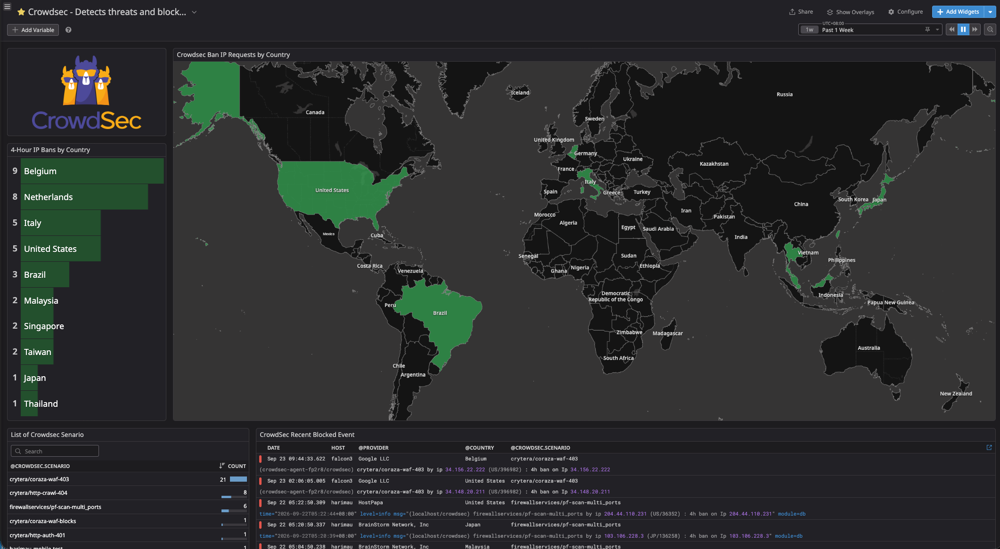

---

```text
                              Internet
                                  │
                                  ▼
                         Cloudflare (FREE)
                    Edge filtering / protection
                                  │
                                  ▼
                         OPNsense Firewall
                              (pf)
                                  │
                                  ▼
                       Caddy Reverse Proxy
                         TLS termination
                                  │
                                  ▼
                        Suricata IDS / IPS
                     Network inspection layer
                                  │
                                  ▼
                         Envoy Gateway
                       Gateway API / Routing
                                  │
                                  ▼
                         Coraza WAF + CRS
                    HTTP application inspection
                                  │
                                  ▼
                     Kubernetes Services / Pods


        ┌──────────────────────────────────────────────────────┐
        │                CROWDSEC #1 — NETWORK                │
        │                                                      │
        │  OPNsense / Caddy / SSH / firewall telemetry        │
        │                         │                            │
        │                         ▼                            │
        │                    CrowdSec LAPI                      │
        │                         │                            │
        │                         ▼                            │
        │                 Detection / Decision                 │
        │                         │                            │
        │                         ▼                            │
        │              OPNsense Firewall Bouncer              │
        │                         │                            │
        │                         ▼                            │
        │                         pf                           │
        │                         │                            │
        │                         ▼                            │
        │                       BLOCK                          │
        └──────────────────────────────────────────────────────┘


        ┌──────────────────────────────────────────────────────┐
        │             CROWDSEC #2 — KUBERNETES                │
        │                                                      │
        │                    Envoy access logs                 │
        │                         │                            │
        │                         ▼                            │
        │              Kubernetes CrowdSec Agents              │
        │                         │                            │
        │             Behavioral detection                    │
        │              401 / 403 / 404 abuse                   │
        │                         │                            │
        │                         ▼                            │
        │                  CrowdSec decision                   │
        │                         │                            │
        │                      4 hours                         │
        │                         │                            │
        │                         ▼                            │
        │                 Cloudflare Worker                    │
        │                         │                            │
        │                         ▼                            │
        │                  Cloudflare KV                       │
        │                         │                            │
        │                         ▼                            │
        │                 EDGE BLOCK                            │
        └──────────────────────────────────────────────────────┘
```

CrowdSec observes **what happened**, correlates behavior over time, and decides **what should be blocked**.

The enforcement point depends on which CrowdSec deployment generated the decision:

* **CrowdSec #1** → OPNsense Firewall Bouncer → `pf`
* **CrowdSec #2** → Cloudflare Worker / KV → Cloudflare edge

CrowdSec itself is **not an inline packet-processing component**.

---

## 🧠 Role of CrowdSec

CrowdSec provides **behavioral detection and decisioning**.

Unlike a deterministic WAF rule that can block an individual HTTP request immediately, CrowdSec evaluates activity across time and correlates multiple events before creating a security decision.

Its responsibilities include:

* Correlating events across multiple logs
* Detecting abusive behavior over time
* Identifying scanners and brute-force activity
* Detecting repeated authentication and HTTP errors
* Detecting known attack patterns supported by installed scenarios
* Creating decisions such as IP bans
* Maintaining decision lifetimes
* Providing threat intelligence and reputation sharing

The key distinction is:

> **CrowdSec detects and decides. A bouncer performs enforcement.**

---

# CrowdSec Deployment #1 — Network / Perimeter

The first CrowdSec deployment protects the network and infrastructure layer.

```text
OPNsense / Caddy / SSH / Firewall Logs
                    │
                    ▼
              CrowdSec Agents
                    │
                    ▼
               CrowdSec LAPI
                    │
                    ▼
          Behavioral Detection
                    │
                    ▼
              CrowdSec Decision
                    │
                    ▼
       OPNsense Firewall Bouncer
                    │
                    ▼
                   pf
                    │
                    ▼
                  BLOCK
```

### Primary responsibilities

* Firewall abuse detection
* SSH brute-force detection
* Network scanning detection
* Infrastructure authentication abuse
* Repeated malicious activity
* Dynamic firewall enforcement

The firewall bouncer converts CrowdSec decisions into dynamic `pf` rules.

CrowdSec therefore remains separated from the packet-processing path while still providing automated enforcement.

---

# CrowdSec Deployment #2 — Kubernetes / Application

The second CrowdSec deployment operates at the Kubernetes application layer.

```text
Envoy Gateway
      │
      │ Access Logs
      ▼
Kubernetes CrowdSec
      │
      ▼
Behavioral Detection
      │
      ├── Excessive 401
      ├── Excessive 403
      └── Excessive 404
      │
      ▼
CrowdSec Decision
      │
      │ 4 hours
      ▼
Cloudflare Worker
      │
      ▼
Cloudflare KV
      │
      ▼
Cloudflare BLOCK
```

This deployment is intentionally **not inline**.

CrowdSec observes Envoy application telemetry and identifies clients exhibiting abusive behavior.

When a decision is created, the Cloudflare Worker/KV integration provides the enforcement mechanism at the public edge.

This allows subsequent requests from a banned IP to be rejected before they traverse the origin infrastructure again.

---

## 📥 Log Sources

### Network / Perimeter CrowdSec

The network deployment can ingest telemetry from:

* OPNsense / `pf`
* Caddy access logs
* SSHD logs
* Firewall services
* Other supported infrastructure sources

Typical information includes:

* Source IP
* Authentication failures
* Connection behavior
* Request activity
* Firewall events
* Repeated failures

### Kubernetes CrowdSec

The Kubernetes deployment consumes application telemetry from:

* Envoy Gateway access logs
* Kubernetes application-layer request logs where explicitly configured

The application deployment is primarily concerned with behavioral HTTP signals such as:

* Repeated `401`
* Repeated `403`
* Repeated `404`
* Request patterns over time
* Repeated access to non-existent or protected resources

---

## 📚 Enabled Collections

The network/perimeter deployment uses the following documented collections:

* `base-http-scenarios`
* `http-cve`
* `firewallservices/pf`
* `opnsense`
* `opnsense-gui`
* `sshd`

These collections provide community-maintained parsers and detection scenarios.

Collection and scenario versions should be treated as configuration dependencies and reviewed during upgrades.

---

# ⚖️ Detection and Decisioning

CrowdSec scenarios can detect behavior such as:

* Port scanning
* Web scanning
* SSH brute-force attempts
* Repeated authentication failures
* Known CVE exploitation behavior
* Excessive HTTP error activity
* Other scenario-defined abusive behavior

Detection is generally **stateful and time-based**.

This is different from deterministic request inspection performed by Coraza.

For example:

```text
Individual HTTP request
        │
        ▼
Coraza / OWASP CRS
        │
        └── Immediate request inspection
```

versus:

```text
Multiple requests
        │
        ▼
CrowdSec
        │
        ▼
Behavioral correlation
        │
        ▼
Decision
```

---

# 🛡️ Enforcement

CrowdSec does not directly perform packet filtering.

Instead:

```text
Detection
   │
   ▼
Decision
   │
   ├───────────────┐
   │               │
   ▼               ▼
CrowdSec #1     CrowdSec #2
   │               │
   ▼               ▼
OPNsense         Cloudflare
Bouncer          Worker / KV
   │               │
   ▼               ▼
pf BLOCK       Edge BLOCK
```

### CrowdSec #1

The OPNsense Firewall Bouncer translates CrowdSec decisions into dynamic firewall enforcement.

### CrowdSec #2

The Cloudflare Worker/KV integration translates Kubernetes CrowdSec decisions into Cloudflare edge enforcement.

The enforcement locations are therefore deliberately separated from the CrowdSec detection engine.

---

# 🔄 Decision Lifecycle

A typical CrowdSec lifecycle is:

1. Telemetry is generated
2. CrowdSec parses the event
3. Scenarios evaluate behavior
4. Multiple events may be correlated
5. A security decision is created
6. A bouncer consumes the decision
7. The enforcement layer blocks the source
8. The decision eventually expires or is removed

For Kubernetes application abuse:

```text
Envoy
  │
  ▼
CrowdSec detection
  │
  ▼
Decision
  │
  │ 4-hour duration
  ▼
Worker / KV
  │
  ▼
Cloudflare BLOCK
```

This separation makes detection and enforcement independently observable.

---

# ☁️ Threat Intelligence

CrowdSec can participate in threat-intelligence sharing through its ecosystem and Console integration.

This can provide:

* Reputation information
* Shared threat signals
* Community-derived intelligence
* Visibility into detected activity

Threat intelligence should complement, rather than replace, local detection and explicit security policy.

---

# 🌐 Relationship to Other Security Layers

| Layer                | Component          | Primary Responsibility                           |
| -------------------- | ------------------ | ------------------------------------------------ |
| Edge                 | Cloudflare         | Edge filtering, challenges and enforcement       |
| L3/L4                | OPNsense           | Stateful firewall, NAT and network enforcement   |
| Network IDS/IPS      | Suricata           | Network inspection, detection and IPS blocking   |
| Reverse Proxy        | Caddy              | TLS termination and controlled proxying          |
| Gateway              | Envoy Gateway      | Gateway API routing and upstream selection       |
| HTTP WAF             | Coraza + OWASP CRS | HTTP request inspection and WAF enforcement      |
| Behavioral Detection | **CrowdSec**       | Correlation, behavioral detection and decisions  |
| Enforcement          | CrowdSec Bouncers  | Apply CrowdSec decisions                         |
| Observability        | Datadog            | Logs, metrics, events and operational visibility |

The responsibilities are intentionally separated.

> **Suricata inspects network traffic.**
> **Coraza inspects HTTP requests.**
> **CrowdSec correlates behavior over time.**
> **Bouncers enforce CrowdSec decisions.**

---

# 🧪 Example — Network Abuse

A typical perimeter detection flow:

```text
Attacker
   │
   ▼
Internet
   │
   ▼
Cloudflare
   │
   ▼
OPNsense
   │
   ├── Firewall telemetry
   │
   ▼
Caddy / infrastructure logs
   │
   ▼
CrowdSec #1
   │
   ▼
Behavioral correlation
   │
   ▼
Decision
   │
   ▼
OPNsense Firewall Bouncer
   │
   ▼
pf
   │
   ▼
BLOCK
```

Future connections from the offending source can then be rejected by the firewall.

---

# 🧪 Example — Kubernetes Application Abuse

A typical application-layer behavioral flow:

```text
Client
  │
  ▼
Cloudflare
  │
  ▼
OPNsense
  │
  ▼
Caddy
  │
  ▼
Suricata IDS/IPS
  │
  ▼
Envoy Gateway
  │
  ▼
Coraza / OWASP CRS
  │
  ▼
Kubernetes
```

Meanwhile, Envoy access telemetry is evaluated separately:

```text
Envoy Access Logs
        │
        ▼
Kubernetes CrowdSec
        │
        ▼
Repeated 401 / 403 / 404
        │
        ▼
CrowdSec Decision
        │
        ▼
Cloudflare Worker / KV
        │
        ▼
Cloudflare BLOCK
```

The CrowdSec path does **not** introduce an additional inline proxy.

---

# 🧠 Why CrowdSec Is Not Inline

CrowdSec is intentionally separated from the request-processing path.

This provides:

* No CrowdSec processing latency added to every request
* Behavioral decisions based on multiple events
* Independent detection and enforcement
* Expiring decisions
* Auditable security decisions
* Independent failure domains
* Ability to change detection logic without inserting another proxy into the traffic path

This architecture also prevents CrowdSec from duplicating responsibilities already handled by:

* Suricata
* Coraza
* OPNsense
* Cloudflare

CrowdSec's role is **behavioral correlation and decisioning**.

---

# 🚦 Allowlisting and False-Positive Control

Because CrowdSec can create automated enforcement decisions, production deployments should maintain explicit exceptions for legitimate sources where required.

Potential examples include:

* Monitoring systems
* CI/CD infrastructure
* Security scanners
* Administrative networks
* Internal automation
* Trusted API integrations
* Known service-to-service traffic

Allowlisting should be narrowly scoped and reviewed regularly.

A legitimate client generating repeated `404`, `401`, or `403` responses should not automatically be treated as malicious without considering the application context.

---

# 📊 Observability & Operations

CrowdSec is part of the security control plane and should be monitored as such.

Operational visibility should include:

* CrowdSec agent health
* LAPI health
* Scenario activity
* Decision creation
* Decision expiry
* Active bans
* Bouncer connectivity
* Bouncer enforcement failures
* Cloudflare Worker errors
* Cloudflare KV failures
* Unexpected decision volume
* Detection spikes
* False-positive indicators

Datadog provides centralized observability for the surrounding infrastructure.

Observability does **not** perform enforcement.

---

# 🔐 Failure and Enforcement Considerations

The detection and enforcement components should be monitored independently.

Examples:

```text
CrowdSec unavailable
        │
        ▼
Existing firewall / WAF / edge controls remain
```

and:

```text
CrowdSec healthy
        │
        ▼
Bouncer unavailable
        │
        ▼
New CrowdSec decisions may not be enforced
```

For this reason, CrowdSec should be treated as one layer in a defense-in-depth architecture rather than the sole protection mechanism.

The primary request path remains protected by independent controls including:

* Cloudflare
* OPNsense
* Suricata
* Coraza
* Kubernetes network and application controls

---

# 📜 Security Model

The architecture deliberately separates three concepts:

### Detection

**What happened?**

CrowdSec analyzes telemetry and identifies behavioral patterns.

### Decision

**What should happen to this source?**

CrowdSec creates a security decision with a defined duration and action.

### Enforcement

**Where should the decision be applied?**

A bouncer or enforcement integration applies the decision:

* OPNsense `pf` for network/perimeter CrowdSec
* Cloudflare Worker/KV for Kubernetes application CrowdSec

This separation makes the system easier to operate, audit and troubleshoot.

---

# ✅ Summary

CrowdSec is the **behavioral detection and decision engine** within the security architecture.

It:

* Observes
* Correlates
* Detects
* Decides
* Delegates enforcement

There are two independent enforcement paths:

```text
CrowdSec #1
Network / Infrastructure
        │
        ▼
OPNsense Firewall Bouncer
        │
        ▼
pf BLOCK
```

and:

```text
CrowdSec #2
Kubernetes / Application
        │
        ▼
Cloudflare Worker / KV
        │
        ▼
Cloudflare BLOCK
```

The overall security model is:

> **Suricata detects and blocks network threats.**
> **Coraza enforces HTTP WAF policy.**
> **CrowdSec correlates behavior over time.**
> **Bouncers enforce CrowdSec decisions.**
> **OPNsense and Cloudflare provide the actual blocking points.**
